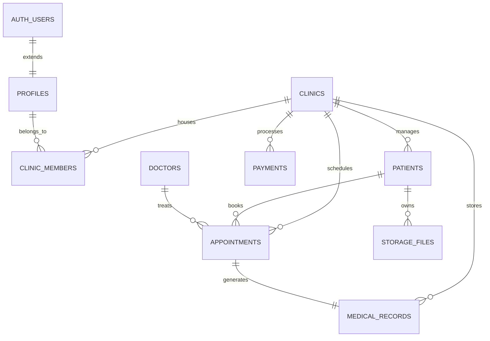

# Arquitetura de Banco de Dados: ClínicaSaaS (Multi-Tenant)

Esta documentação detalha a arquitetura do sistema de gestão de clínicas médicas, focada em escalabilidade, segurança (RLS) e conformidade médica (Auditoria).

---

## 1. Visão Geral da Arquitetura
- **Multi-Tenancy:** Estratégia de "Shared Schema, Separate Row". Cada registro possui um `clinic_id`.
- **Tenancy Isolation:** Garantida através de Supabase Row Level Security (RLS).
- **Extensibilidade:** Uso de JSONB em tabelas como `clinics`, `patients` e `medical_records` para dados flexíveis.
- **Segurança de Dados Médicos:** Auditoria automática via triggers e tabelas dedicadas.

## 2. Diagrama Entidade-Relacionamento (ER) Textual



## 3. Principais Módulos e Tabelas

### Autenticação e Perfis
- **`auth.users`**: Gerenciado pelo Supabase Auth.
- **`profiles`**: Repositório de dados extras (CRM, Especialidade, Telefone).
- **`clinic_members`**: Tabela pivot que define quem trabalha onde e com qual cargo (`role`).

### Gestão Clínica
- **`clinics`**: O "Tenant". Controla as configurações da unidade.
- **`patients`**: Cadastro completo do paciente. Pode ou não estar vinculado a um `profile` (se o paciente tiver acesso ao app).
- **`appointments`**: Fluxo de agendamento com status (`scheduled`, `completed`, etc).
- **`medical_records`**: O prontuário. Altamente protegido.

### Auditoria e Compliance
- **`audit_logs`**: Registra cada alteração (Insert/Update/Delete) em tabelas críticas. Fundamental para conformidade com o CFM e LGPD.

## 4. Row Level Security (RLS) Avançado

A segurança é baseada na função `get_my_clinic_role(cid)`. 

**Estratégia de Acesso:**
- **Recepcionista:** Pode ver `patients`, `appointments` e `payments`, mas NÃO pode ver `medical_records`.
- **Médico:** Pode ver tudo da sua clínica, especialmente `medical_records`.
- **Paciente:** (Opcional) Pode ver seus próprios `appointments` e `exams`.

## 5. Exemplos de Implementação

### Inserindo um Agendamento (SQL)
```sql
INSERT INTO appointments (clinic_id, doctor_id, patient_id, start_time, end_time, status)
VALUES ('uuid-clinica', 'uuid-medico', 'uuid-paciente', '2024-05-20 10:00:00+00', '2024-05-20 10:30:00+00', 'scheduled');
```

### Consultando com Supabase JS (Frontend)
```javascript
import { createClient } from '@supabase/supabase-js'

const supabase = createClient(process.env.URL, process.env.KEY)

// Buscar pacientes da clínica atual (RLS filtra automaticamente)
const { data, error } = await supabase
  .from('patients')
  .select('full_name, last_appointment:appointments(start_time)')
  .eq('clinic_id', 'uuid-da-clinica')
```

### Upload de Exames (Bucket Logic)
Sugestão de estrutura de pastas no Storage:
`exams/{clinic_id}/{patient_id}/{file_name}`

## 6. Boas Práticas Supabase

1. **Definer vs Invoker:** Funções de RLS devem ser `security definer` com cuidado para não vazar dados, mas permitindo que usuários consultem suas permissões sem recursão infinita.
2. **Índices GIN:** Use índices GIN em colunas JSONB para buscas rápidas dentro de metadados.
3. **Soft Delete:** A coluna `deleted_at` é padrão. Crie políticas que filtram `where deleted_at is null` por padrão.
4. **Criptografia:** Dados de prontuário sensíveis (`medical_records.content`) devem ser criptografados na aplicação antes de irem para o banco (End-to-End Encryption).

---
*Este modelo está pronto para produção e segue os padrões de escalabilidade SaaS.*
